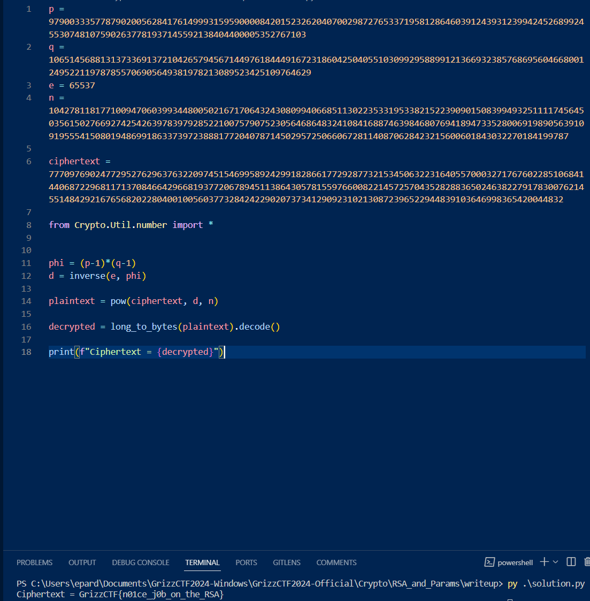

# Params and RSA

## Objectives

This challenge demonstrates the practical application of RSA encryption and decryption. Participants will leverage provided RSA parameters to decipher a ciphertext, gaining insights into the workings of this fundamental cryptographic system.

## RSA Deep Dive

The RSA algorithm, named after its creators Rivest, Shamir, and Adleman, is a cornerstone of modern cryptography, used extensively for secure communication and digital signatures. Let's break down its core concepts:

### Key Generation

1. **Choosing Primes:** Select two large, distinct prime numbers (`p` and `q`). Their size greatly influences the security of RSA; the larger the primes, the more difficult it is to break the encryption.
2. **Modulus Calculation:**  Compute the modulus `n = p * q`. This `n` is a vital component of both the public and private keys.
3. **Euler's Totient:** Calculate Euler's totient function, `φ(n) = (p - 1) * (q - 1)`.  `φ(n)` gives the number of positive integers less than `n` that are co-prime (share no common factors) with `n`.
4. **Public Exponent:** Select a public exponent `e` within the range `1 < e < φ(n)` that also satisfies `gcd(e, φ(n)) = 1` (meaning `e` and `φ(n)` are co-prime).  `e` is commonly a small prime number.
5. **Private Exponent:** Determine the private exponent `d` as the modular multiplicative inverse of `e` modulo `φ(n)`. Therefore, `d * e ≡ 1 (mod φ(n))`. This calculation ensures encryption and decryption operations are inverses.

### Encryption and Decryption

- **Encryption:** To encrypt a plaintext message `M` (represented as a numerical value), calculate the ciphertext `C`:
   ``` 
   C = M^e mod n 
   ```
- **Decryption:** To recover the original plaintext `M` from the ciphertext `C`, calculate:
   ```
   M = C^d mod n
   ```

### RSA Security

The RSA algorithm's strength lies in the challenge of factoring the modulus `n`. Discovering the prime factors `p` and `q` from `n` is computationally infeasible with large primes. To maintain sufficient security as processing power advances, larger key sizes must be used.

### Challenge Details

**Parameters:**

- Primes: `p`, `q`
- Public exponent: `e`
- Modulus: `n`
- Ciphertext: `C`

**Objective:**
- Decrypt the ciphertext to uncover the hidden message.

#### Solution Guide

1. **Derive the Private Key:**
   - Compute `φ(n) = (p - 1) * (q - 1)`.
   - Determine the private exponent `d` using the extended Euclidean algorithm or Python libraries:
     ```python
     from Crypto.Util.number import inverse, long_to_bytes 

     d = inverse(e, phi)
      ```

2. **Decrypt the Ciphertext:**
   - Apply the decryption formula: `M = C^d mod n`.
```python
plaintext= = pow(ciphertext, d, n)
```
3. **Decode the Message:**
   * Transform the decrypted numerical value `M` into its corresponding text representation to reveal the secret message.
```python
from Crypto.Util.number import inverse, long_to_bytes
decryptedPlaintext = long_to_bytes(plaintext).decode()
```
**Let's get cracking!** 
