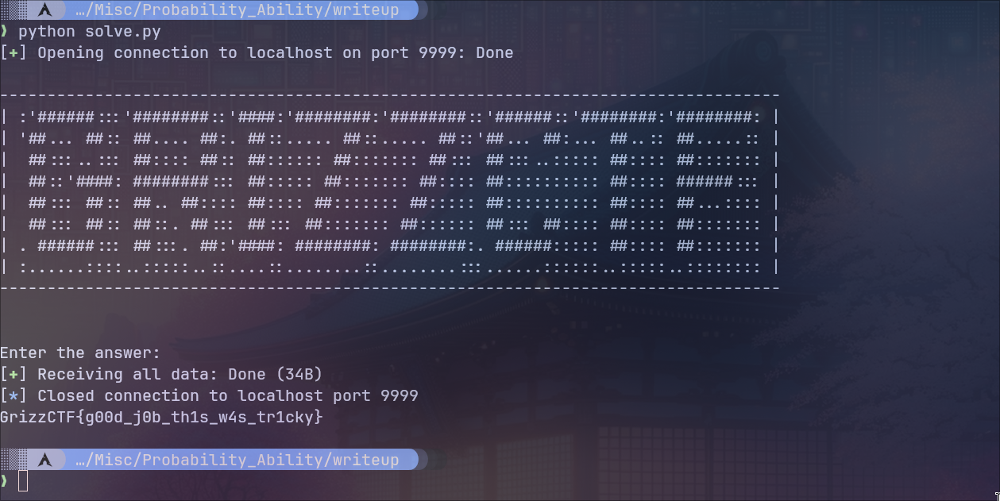

Absolutely! Here's a potential writeup as the challenge creator, aiming for a concise and to-the-point style:

Challenge Name: Probability Ability

Category: Miscellaneous

Difficulty: Easy/Medium (Depends on background knowledge)

**Description**: This challenge tests your understanding of basic probability concepts and large numbers. Consider the likelihood of various events, from guessing a cryptographic key to winning the lottery multiple times. Can you rank them from most likely to least likely?

## Solution:
Understanding Probabilities:
- The probability of guessing a 128-bit AES key correctly on the first try is 1 / 2^128 (a vanishingly small number).
- Winning a lottery with 1 million contestants has a probability of 1 / 1,000,000.
- Winning a lottery multiple times consecutively becomes exponentially less likely with each win.

### Calculating Probabilities
```python
import numpy as np
prob_aes_key = 1 / 2**128
prob_lottery_win = 1 / 10**6
prob_lottery_win_5 = prob_lottery_win ** 5
prob_lottery_win_6 = prob_lottery_win ** 6
prob_lottery_win_7 = prob_lottery_win ** 7

probabilities = np.array([
    prob_aes_key, 
    prob_lottery_win, 
    prob_lottery_win_5, 
    prob_lottery_win_6,
    prob_lottery_win_7
])
```
### Formating the flag correctly for submission
```python
event_order = np.argsort(probabilities)[::-1] + 1 
answer = ", ".join(str(x) for x in event_order)
```
#### Key Concepts
- **Probability Theory**: Understanding how to calculate the likelihood of independent events.

##### How to run solution
1. Make sure `pwntools` is installed using: `pip install pwntools`
2. Edit the connection configuration (hostname, port) if needed.
3. Run the [solution](solve.py)
    - `python solve.py`



